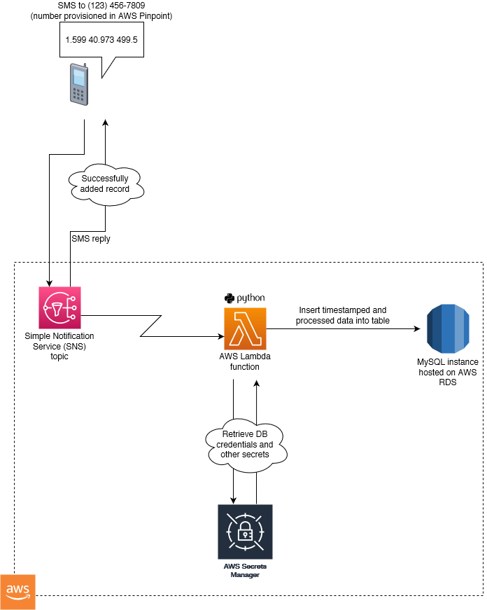
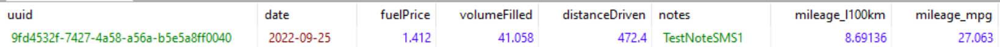

# mileage

Ever wanted to record a little bit of structured data on the fly, but wanted somewhere more robust to store it than your iPhone's "Notes" app, an email message sent to yourself, or a hastily scribbled note?  This project could be what you're looking for.

## Background

This is a tool for remotely collecting structured data on the go, storing the data in a MySQL table and using SMS as the medium of communication.  Hosted as an AWS Lambda function, the main script is triggered by an AWS SNS topic listening for SMS messages containing structured data sent to a provisioned phone number.  The script then validates this data and inserts it into the table if valid, before sending a confirmation SMS reply.

## But... why?

This started out as a project of mine to collect data on my car's fuel efficiency.  I started collecting the data in a Google Sheet with some formulas, but quickly got tired of trying to input data into the spreadsheet using my phone while wasting a little bit of my data every time I stopped at a gas station.  So, like a typical developer, I came up with a totally over-engineered solution.

## How it works

Currently, this is set up to collect fuel efficiency data, but with some changes to the schema you could reconfigure this to collect any kind of structured data you want.

To submit some data to be collected, type it up in an SMS. The script expects an SMS in the following format: fuel price [$/L], volume filled [L], distance driven [km], optional notes.  

For instance, if you paid **$1.412** per litre, filled up your car with **41.058** litres of gas, and had driven **472.4 km** on your previous tank of gas, your SMS would look like this:  `1.412 41.058 472.4 TestNoteSMS1`.  Go ahead and send this SMS to the provisioned AWS SNS phone number.  When SNS receives the message, it will trigger the AWS Lambda where the script lives, which will then parse and clean the data, generate a UUID for the new record, compute the fuel efficiency, and insert it into the DB.  Finally, SNS will send a confirmation SMS back to you. 




The data you sent in the SMS is now recorded in the database:




## Setup

### Requirements 

Python 3, `pipenv`, and access to AWS resources.

### Dependencies and deployment

To install dependencies (listed in Pipfile): `pipenv install`

To deploy to an AWS lambda: have Pipenv generate a requirements.txt, install these to a directory, zip everything up and upload it to AWS:

```
$ pipenv lock -r > requirements.txt
$ mkdir package
$ pip install -R requirements.txt --target package
$ zip -r lambda_function.zip lambda_function.py package/
```

### AWS setup

Provision the following in AWS:

* SMS number in AWS Pinpoint
* SNS (Simple Notification Service) topic to process incoming messages - used to trigger the lambda function
* Database using AWS RDS (I used MySQL)
* A VPC to connect everything together
* An AWS lambda function.  This is where the script lives.  Upload the package you created earlier (`lambda_function.zip`) and have your SNS topic trigger the Lambda when an SMS is received.  Don't forget to set up environment variables in your Lambda (see below).

### Environment variables

You'll also need to set up some environment variables in your Lambda:

* `DB_CREDENTIALS_SECRET_NAME`: The name of the Secrets Manager secret containing your DB credentials
* `PINPOINT_APP_ID`: The Pinpoint Application ID

